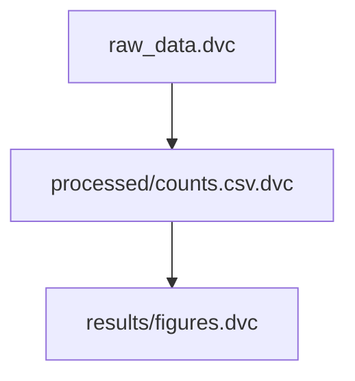

# dt summary

Generate project documentation files for DVC-tracked data.

## Usage

```bash
dt summary [options]
```

## Description

Creates summary documentation files by wrapping DVC commands:

- **tree.txt** - File listing via `dvc list --tree --dvc-only .`
- **dag.md** - Pipeline DAG via `dvc dag --md` (mermaid format)

By default, both files are generated in the `docs/` directory.

## Options

| Option | Description |
|--------|-------------|
| `-o, --out <dir>` | Output directory (default: docs/) |
| `--tree-only` | Generate only tree.txt |
| `--dag-only` | Generate only dag.md |

## Configuration

The output directory can be configured in `.dt/config.yaml`:

```yaml
summary:
  output_dir: docs/
```

Priority:
1. `--out` flag (highest)
2. `summary.output_dir` config value
3. Default: `docs/`

## Examples

```bash
# Generate both tree.txt and dag.md to docs/
dt summary

# Generate only the file tree
dt summary --tree-only

# Generate only the pipeline DAG
dt summary --dag-only

# Output to current directory
dt summary -o .

# Output to a custom directory
dt summary -o project_docs/
```

## Output Examples

### tree.txt

Shows only DVC-tracked files (excludes `.dvc` files, `.gitignore`, etc.):

```
.
├── raw_data
│   ├── sample_A.fastq.gz
│   ├── sample_B.fastq.gz
│   └── sample_C.fastq.gz
├── processed
│   └── counts.csv
└── results
    └── figures
        ├── figure1.png
        └── figure2.png
```

### dag.md

Mermaid diagram of the DVC pipeline (renders on GitHub):



## See Also

- [dt doctor](doctor.md) - Diagnose setup issues
- [DVC list documentation](https://dvc.org/doc/command-reference/list)
- [DVC dag documentation](https://dvc.org/doc/command-reference/dag)
